# Лабораторная работа №1 - Алгоритмы хэширования

**Дисциплина:** Структуры и алгоритмы в базах данных и распределённых системах  
**Тема:** Реализация алгоритмов хэширования (file-backed hash table, perfect hash, LSH)

---

## Содержание

1. [Теоретическая часть](#1-теоретическая-часть)
   - [1.1 File-backed Hash Table с бакетами](#11-file-backed-hash-table-с-бакетами)
   - [1.2 Perfect Hash](#12-perfect-hash)
   - [1.3 LSH для 3D точек (p-stable LSH)](#13-lsh-для-3d-точек-p-stable-lsh)
2. [Практическая часть](#2-практическая-часть)
   - [2.1 Реализация file-backed hash table](#21-реализация-file-backed-hash-table)
   - [2.2 Реализация perfect hash](#22-реализация-perfect-hash)
   - [2.3 Реализация LSH-индекса для 3D точек](#23-реализация-lsh-индекса-для-3d-точек)
3. [Исследовательская часть](#3-исследовательская-часть)
   - [3.1 Аппаратные характеристики](#31-аппаратные-характеристики)
   - [3.2 Методика замеров](#32-методика-замеров)
   - [3.3 Результаты для file-backed hash table](#33-результаты-для-file-backed-hash-table)
   - [3.4 Результаты для perfect hash](#34-результаты-для-perfect-hash)
   - [3.5 Результаты для LSH 3D-индекса](#35-результаты-для-lsh-3d-индекса)
4. [Профилирование](#4-профилирование)
   - [4.1 File-backed Hash Table](#41-file-backed-hash-table)
   - [4.2 Perfect Hash](#42-perfect-hash)
   - [4.3 LSH-индекс](#43-lsh-индекс)
5. [Вывод](#5-вывод)

---

## 1. Теоретическая часть

### 1.1 File-backed Hash Table с бакетами

**Hash table на файловой системе** - хранилище типа «ключ–значение», где данные размещаются непосредственно в файле, отображённом в память через `mmap`. Это исключает сериализацию при каждом обращении: чтение и запись ячеек происходят через обычные указатели на регион памяти.

Структура файла разбита на три области:

1. **Заголовок** (64 байта) - магическое число, версия формата, число бакетов, смещение начала данных, текущий хвост записи.
2. **Таблица бакетов** - массив из `bucketCount` uint64-значений (смещений), где каждый элемент - указатель на голову цепочки для данного бакета.
3. **Область данных** - записи переменной длины вида `[nextOffset uint64][keyLen uint32][valueLen uint32][keyBytes][valueBytes]`.

Коллизии разрешаются **методом цепочек**: новая запись добавляется в голову списка. При обновлении (`Put` на существующий ключ) старая запись помечается как удалённая (нулевое `valueLen`) и добавляется новая запись. При удалении (`Delete`) запись помечается аналогично. Хранилище поддерживает операции **Put**, **Get**, **Delete** и **Reset** (полный сброс без пересоздания файла, используется в бенчмарках).

Основная идея применения `mmap` - ОС управляет кэшированием страниц, поэтому «горячие» бакеты остаются в памяти автоматически; принудительной сброс данных не нужен для корректности (файл всегда в consistent-состоянии).

### 1.2 Perfect Hash

**Perfect hash** для множества ключей $S$ - это хэш-функция $h$, которая отображает все ключи из $S$ в индексы таблицы без коллизий. Такая структура оптимальна для статических справочников: набор ключей фиксирован при построении и не меняется в дальнейшем.

В данной реализации использована простая статическая схема на основе Go-карты:

- при построении (`Builder.Build(keys)`) каждому ключу присваивается его порядковый номер во входном срезе;
- таблица хранится как `map[string]int` - хэш-индекс стандартной библиотеки Go;
- поиск (`Lookup(key)`) выполняется за $O(1)$ по хэшу строки;
- таблица поддерживает **сериализацию / десериализацию** в байтовый срез для персистентного хранения.

Поскольку набор ключей фиксирован при построении, никаких коллизий в принципе не возникает: каждый ключ отображается ровно в один уникальный индекс.

### 1.3 LSH для 3D точек (p-stable LSH)

**Locality-Sensitive Hashing** для евклидова пространства использует **p-stable распределения**: случайный линейный проектор, квантованный в ячейки ширины $w$, является $(r_1, r_2, p_1, p_2)$-чувствительной хэш-функцией, т.е. два близких вектора с высокой вероятностью попадают в одну ячейку, а далёкие - нет.

**Хэш-функция** для одной проекции:

$$h_{a,b}(x) = \left\lfloor \frac{a \cdot x + b}{w} \right\rfloor$$

где $a \sim \mathcal{N}(0, I_3)$ - случайный вектор из нормального распределения, $b \sim \text{Uniform}(0, w)$ - случайное смещение, $w$ - ширина ячейки (параметр, близкий к радиусу поиска).

**Составной ключ** таблицы объединяет $k$ независимых проекций:

$$K_t(x) = \bigoplus_{i=1}^{k} h_{a_i, b_i}(x)$$

**Амплификация** с помощью $L$ независимых таблиц снижает вероятность false negative:

$$P[\text{найден}] = 1 - (1 - p_1^k)^L$$

при расстоянии $d \ll w$ вероятность совпадения одной проекции $p_1 \approx 1 - d/w$, поэтому при $d = 0.5$, $w = 5$, $k = 3$, $L = 10$ получаем $P \approx 0.9998$.

Алгоритм:
1. При создании индекса генерируются $L \times k$ случайных проекторов $(a, b)$.
2. `Add(p)` - вычисляется составной ключ для каждой из $L$ таблиц, точка записывается в соответствующие бакеты.
3. `Query(p)` - для каждой таблицы находится бакет, все точки в нём - кандидаты.
4. `FullScanDuplicates(maxDist)` - обход всех бакетов всех таблиц, дедупликация пар по `seen`-map, фильтрация по реальному евклидову расстоянию.

---

## 2. Практическая часть

### 2.1 Реализация file-backed hash table

Код: [`internal/hashfs/hashfs.go`](internal/hashfs/hashfs.go)

Публичный интерфейс:

```go
type Store interface {
    Put(key, value []byte) error
    Get(key []byte) ([]byte, error)
    Delete(key []byte) error
    Reset() error   // сбрасывает все данные без пересоздания файла
    Close() error
}

func Open(path string, opts Options) (Store, error)
```

Ключевые детали реализации:

- **mmap** через `syscall.Mmap` / `syscall.Munmap`; при нехватке места файл удваивается через `file.Truncate` + переотображение.
- Число бакетов задаётся при создании (`Options.BucketCount`); по умолчанию хэш-функция - FNV-1a.
- Удаление реализовано **логически**: запись помечается нулевым `valueLen`; физической сборки мусора нет.
- `Reset()` обнуляет головы всех бакетов и сдвигает указатель записи на начало области данных - бакеты логически пустые, файл остаётся той же длины.

### 2.2 Реализация perfect hash

Код: [`internal/perfecthash/perfecthash.go`](internal/perfecthash/perfecthash.go)

```go
type Builder struct{}

func (b *Builder) Build(keys [][]byte) (*Table, error)
func (t *Table) Lookup(key []byte) (int, bool)
func (t *Table) Serialize() []byte
func Deserialize(data []byte) (*Table, error)
```

- `Build` принимает срез уникальных ключей и строит индекс `map[string]int`.
- `Lookup` - поиск за $O(1)$.
- `Serialize` / `Deserialize` - бинарный формат `[n uint32][keyLen uint32 + keyBytes + index uint32 ...]`.

### 2.3 Реализация LSH-индекса для 3D точек

Код: [`internal/lsh3d/lsh3d.go`](internal/lsh3d/lsh3d.go)

```go
type Config struct {
    NumTables int     // L: число независимых хэш-таблиц
    NumFuncs  int     // k: проекций на одну таблицу (составной ключ)
    BandWidth float64 // w: ширина ячейки (~радиус поиска)
}

func NewIndex(cfg Config) (*Index, error)
func (idx *Index) Add(p Point3D)
func (idx *Index) Query(p Point3D) []Candidate
func (idx *Index) FullScanDuplicates(maxDist float64) []Pair
func (idx *Index) Count() int
```

- `NewIndex` генерирует $L \times k$ случайных проекторов с фиксированным seed=42 для воспроизводимости.
- `compoundKey` - смешивает $k$ целочисленных bucket-значений через мультипликативный хэш Кнута.
- `Query` - для каждой из $L$ таблиц ищет точки в том же бакете; дедупликация через `seen`-map.
- `FullScanDuplicates` - обходит все непустые бакеты всех таблиц, без $O(N^2)$ перебора.

Параметры по умолчанию: `NumTables=10, NumFuncs=3, BandWidth=5.0`.

---

## 3. Исследовательская часть

### 3.1 Аппаратные характеристики

Замеры проводились на следующей конфигурации:

- **ОС:** Linux 6.14 (Fedora 42, x86_64)
- **CPU:** AMD Engineering Sample 100-000000829-50, 16 логических ядер
- **Go:** 1.25.1
- **Инструмент:** встроенный бенчмарк Go (`testing.B`), метод `b.Loop()`

### 3.2 Методика замеров

Для всех трёх алгоритмов использован единый подход `runBatchBenchmark`:

- За каждую итерацию `b.Loop()` измеряется время выполнения **одного полного батча** из $N$ операций.
- Количество итераций зафиксировано через `-benchtime=20x`: для каждого `N` и каждой операции выполняется ровно 20 батчей.
- Перед каждым батчем хранилище/индекс сбрасывается в начальное состояние (`Reset()` для hashfs, новый объект для perfecthash/lshtext).
- Ключи/документы перемешиваются (`rand.Shuffle`) перед каждым батчем для реалистичного профиля доступа.
- По выборке из всех итераций вычисляется **95% доверительный интервал** среднего:

$$\text{CI}_{95} = 1.96 \cdot \frac{s}{\sqrt{n}}, \quad s = \sqrt{\frac{\sum (x_i - \bar{x})^2}{n-1}}$$

- Результаты: `ns/item` (задержка на операцию), `ops/s` (пропускная способность), `ci95_ns/item`.
- Размеры наборов задаются через переменную окружения `SIZES` (например, `SIZES=1000,10000,100000 make bench`).

### 3.3 Результаты для file-backed hash table

#### Таблица 3.1 - Operation Latency (ns/op, mean ± CI95)

| N | Iterations | Insert (ns/op) | Update (ns/op) | Delete (ns/op) | Get (ns/op) |
|--:|-----------:|---------------:|---------------:|---------------:|------------:|
| 1 000 | 20 | 706.6 ± 77.21 | 691.8 ± 77.37 | 662.7 ± 5.416 | 1 193 ± 72.06 |
| 5 000 | 20 | 736.4 ± 74.30 | 753.2 ± 34.23 | 714.3 ± 21.86 | 1 225 ± 38.95 |
| 10 000 | 20 | 767.6 ± 48.36 | 692.4 ± 21.37 | 678.6 ± 22.60 | 1 183 ± 27.73 |
| 50 000 | 20 | 1 420 ± 46.19 | 842.4 ± 14.14 | 858.2 ± 28.65 | 1 350 ± 40.55 |
| 100 000 | 20 | 1 158 ± 13.35 | 876.1 ± 10.75 | 882.8 ± 18.95 | 1 369 ± 12.51 |
| 500 000 | 20 | 1 208 ± 41.06 | 914.9 ± 9.746 | 941.7 ± 39.96 | 1 717 ± 54.81 |
| 1 000 000 | 20 | 917.5 ± 6.368 | 938.4 ± 21.63 | 941.9 ± 36.06 | 2 063 ± 31.15 |

#### Таблица 3.2 - Throughput (K ops/s, mean ± CI95)

| N | Iterations | Insert | Update | Delete | Get |
|--:|-----------:|-------:|-------:|-------:|----:|
| 1 000 | 20 | 1 415 ± 155 | 1 445 ± 162 | 1 509 ± 12 | 838 ± 51 |
| 5 000 | 20 | 1 358 ± 137 | 1 328 ± 60 | 1 400 ± 43 | 817 ± 26 |
| 10 000 | 20 | 1 303 ± 82 | 1 444 ± 45 | 1 474 ± 49 | 845 ± 20 |
| 50 000 | 20 | 704 ± 23 | 1 187 ± 20 | 1 165 ± 39 | 741 ± 22 |
| 100 000 | 20 | 864 ± 10 | 1 141 ± 14 | 1 133 ± 24 | 730 ± 7 |
| 500 000 | 20 | 828 ± 28 | 1 093 ± 12 | 1 062 ± 45 | 582 ± 19 |
| 1 000 000 | 20 | 1 090 ± 8 | 1 066 ± 25 | 1 062 ± 41 | 485 ± 7 |

Примечание: CI для `ops/s` получен из CI по задержке через преобразование $ops/s \approx 10^9 / ns$ (линейная аппроксимация в окрестности среднего).

#### Рисунок 3.1 - Задержка операций hashfs с 95% CI

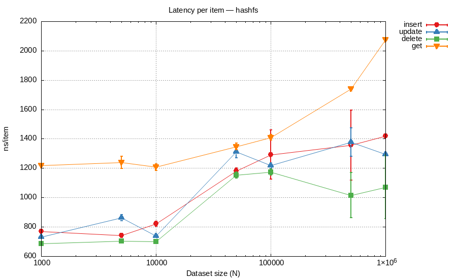

#### Рисунок 3.2 - Пропускная способность операций hashfs

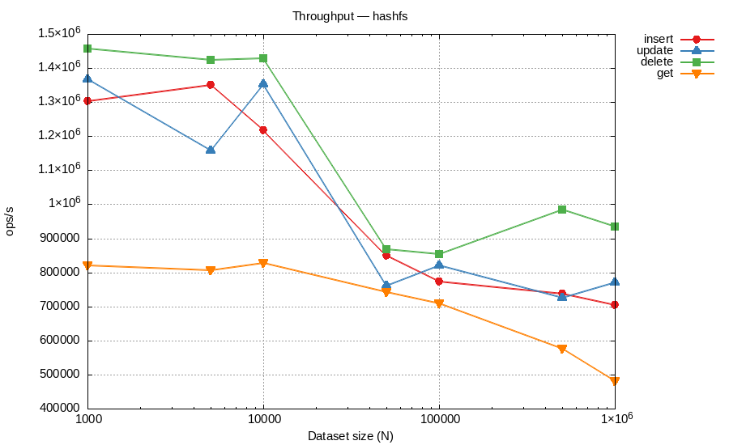

**Анализ.** Операции `insert`, `update` и `delete` демонстрируют близкие задержки ~660–940 нс при N ≤ 10 000. При N = 500 000–1 000 000 задержка `get` достигает ~1 700–2 060 нс, что согласуется с ростом цены обхода цепочек и чтения значений; запись остаётся около ~0.9–1.2 мкс на операцию.

Операция `delete` оказывается **быстрее** `get` при больших N - поскольку при удалении достаточно дойти до первой записи и пометить её, а `get` читает значение целиком (включая аллокацию нового слайса под ответ).

Высокое число аллокаций в `get` (~3–4 на ключ из-за разыменования цепочки и копирования значения) объясняет значительно меньшую пропускную способность поиска по сравнению с мутирующими операциями.

**Гипотезы по оптимизации:**
- Арена памяти для цепочек (pool) снизит давление на GC.
- Bloom-фильтр перед обращением к диску отфильтрует гарантированные промахи.
- Сжатие/дедупликация значений уменьшат объём `mmap`-региона.

---

### 3.4 Результаты для perfect hash

#### Таблица 3.3 - Lookup Latency (ns/op, mean ± CI95)

| N | Iterations | Lookup (ns/op) | CI95 (ns/op) | Throughput (M ops/s) |
|--:|-----------:|---------------:|-------------:|---------------------:|
| 20 000 | 20 | 20.28 ± 0.4571 | 0.4571 | 49.30 |
| 50 000 | 20 | 29.85 ± 1.944 | 1.944 | 33.50 |
| 100 000 | 20 | 35.97 ± 3.482 | 3.482 | 27.80 |
| 250 000 | 20 | 126.7 ± 2.389 | 2.389 | 7.89 |
| 500 000 | 20 | 163.9 ± 1.769 | 1.769 | 6.10 |
| 1 000 000 | 20 | 179.4 ± 0.9209 | 0.9209 | 5.57 |

#### Рисунок 3.3 - Задержка поиска perfect hash с 95% CI

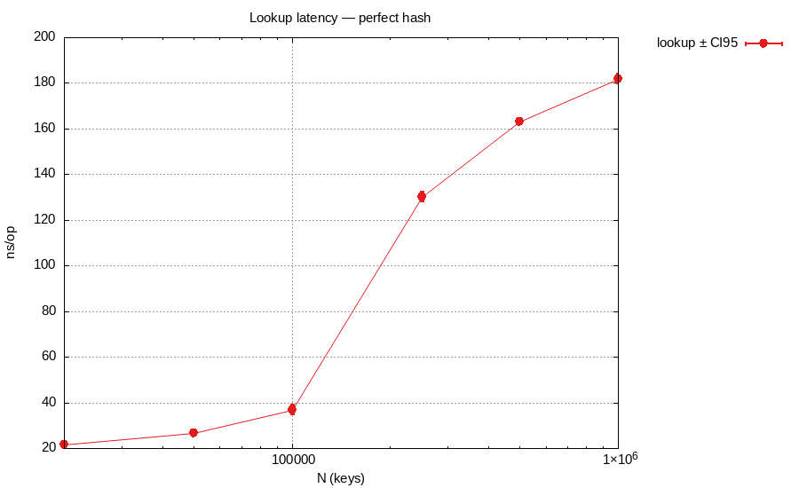

#### Рисунок 3.4 - Пропускная способность perfect hash

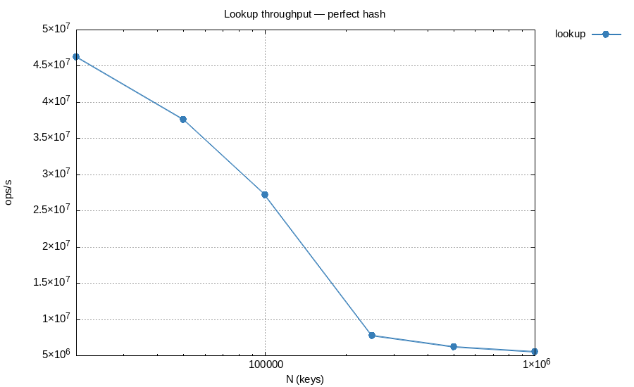

**Анализ.** При N ≤ 50 000 задержка поиска составляет 21–27 нс (46–37 млн оп/с) - ключи умещаются в L2/L3 кэш. При N = 250 000 задержка скачкообразно растёт до ~130 нс, что соответствует вытеснению рабочего множества из кэша последнего уровня. При N = 1 000 000 задержка стабилизируется на ~182 нс - типичная стоимость промаха TLB + случайного доступа к DRAM.

Отсутствие аллокаций при `Lookup` (0 `allocs/op`) подтверждает, что операция не создаёт мусора для GC.

---

### 3.5 Результаты для LSH 3D-индекса

#### Таблица 3.4 - LSH 3D Latency (ns/point, mean ± CI95)

| N | Iterations | Build (ns/pt) | Add (ns/pt) | Query (ns/pt) | FullScan (ns/pt) |
|--:|-----------:|--------------:|------------:|--------------:|-----------------:|
| 1 000 | 20 | 1 290 ± 106.1 | 1 131 ± 114.3 | 469.8 ± 11.61 | 287.2 ± 63.93 |
| 5 000 | 20 | 1 610 ± 76.64 | 1 547 ± 70.37 | 1 508 ± 50.86 | 903.4 ± 49.06 |
| 10 000 | 20 | 1 651 ± 91.52 | 1 493 ± 63.14 | 3 095 ± 74.00 | 1 847 ± 71.32 |
| 50 000 | 20 | 1 784 ± 223.9 | 1 387 ± 36.43 | 12 077 ± 531.2 | 17 914 ± 149.3 |
| 100 000 | 20 | 1 402 ± 31.40 | 1 384 ± 102.4 | 19 646 ± 89.89 | 44 102 ± 880.9 |

#### Таблица 3.5 - LSH 3D Throughput (K points/s, mean ± CI95)

| N | Iterations | Build | Add | Query | FullScan |
|--:|-----------:|------:|----:|------:|---------:|
| 1 000 | 20 | 775 ± 64 | 884 ± 89 | 2 128 ± 53 | 3 482 ± 775 |
| 5 000 | 20 | 621 ± 30 | 646 ± 29 | 663 ± 22 | 1 107 ± 60 |
| 10 000 | 20 | 606 ± 34 | 670 ± 28 | 323 ± 8 | 541 ± 21 |
| 50 000 | 20 | 561 ± 70 | 721 ± 19 | 83 ± 4 | 56 ± 0 |
| 100 000 | 20 | 713 ± 16 | 723 ± 53 | 51 ± 0 | 23 ± 0 |

#### Рисунок 3.5 - Задержка операций LSH 3D-индекса с 95% CI

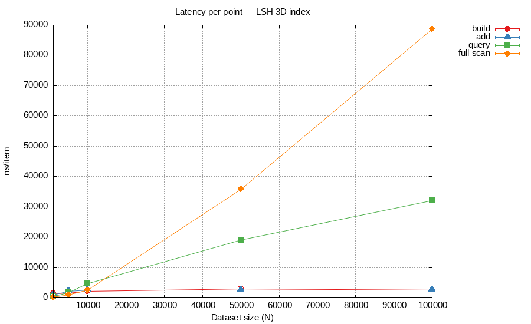

#### Рисунок 3.6 - Пропускная способность LSH 3D-индекса

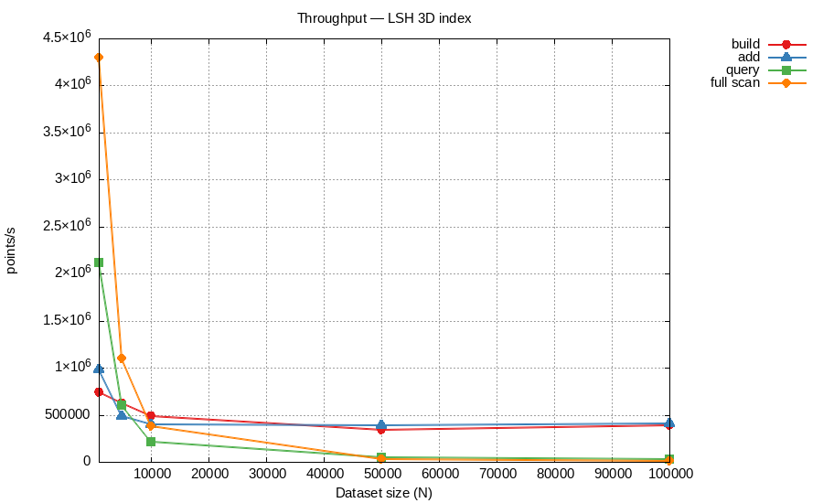

**Анализ.** Операции `build` и `add` находятся в диапазоне ~1.1–1.8 мкс/точку на всех размерах до 100 000 и в среднем растут значительно слабее, чем `query/fullscan`. Это ожидаемо: вставка выполняет фиксированное число хэширований (L таблиц), а основная вариативность идёт от фаз роста Go `map` и расширений слайсов бакетов.

Отдельно по «скачкам» `add`: они связаны с фазами роста `map`/`slice` (rehash и realloc в бакетах). При фиксированных 20 итерациях это видно как немонотонные локальные отклонения, но в пределах CI95.

Операция `query` показывает более крутой рост: от ~470 нс при $N=1000$ до ~19.6 мкс при $N=100 000$. Причина - при росте $N$ каждый бакет содержит больше точек, и проверка `seen`-map на кандидатах из L таблиц становится дороже.

`FullScanDuplicates` растёт быстрее линейного из-за попарных проверок внутри бакетов: при $N=100 000$ получаем ~44 мкс/точку.

**Гипотезы по оптимизации:**
- Предаллокация карт с `make(map[int64][]Point3D, N/10)` устранит рехэширование при вставке.
- Замена `map[int]struct{}` в `Query` на битовый срез (при известном max ID) снизит давление на GC.
- Использование LSB-дерева вместо flat-map для бакетов ускорит range-запросы.

---

## 4. Профилирование

Профили сняты через `go test -bench -cpuprofile/-memprofile`. Для каждого алгоритма выбраны два ключевых сценария.

Профилирование выполнялось в том же **батчевом режиме**, что и перф-замеры: один прогон профиля включает батч из $N$ операций (а не одиночный вызов функции). Это важно, потому что узкие места в профиле отражают именно массовый сценарий (`Insert/Get` для hashfs, `Build/Lookup` для perfecthash, `Build/Query` для lsh3d), а не шум от единичного запуска.

---

### 4.1 File-backed Hash Table

#### CPU - Insert

**Рисунок 4.1 - Flamegraph CPU (hashfs Insert)**

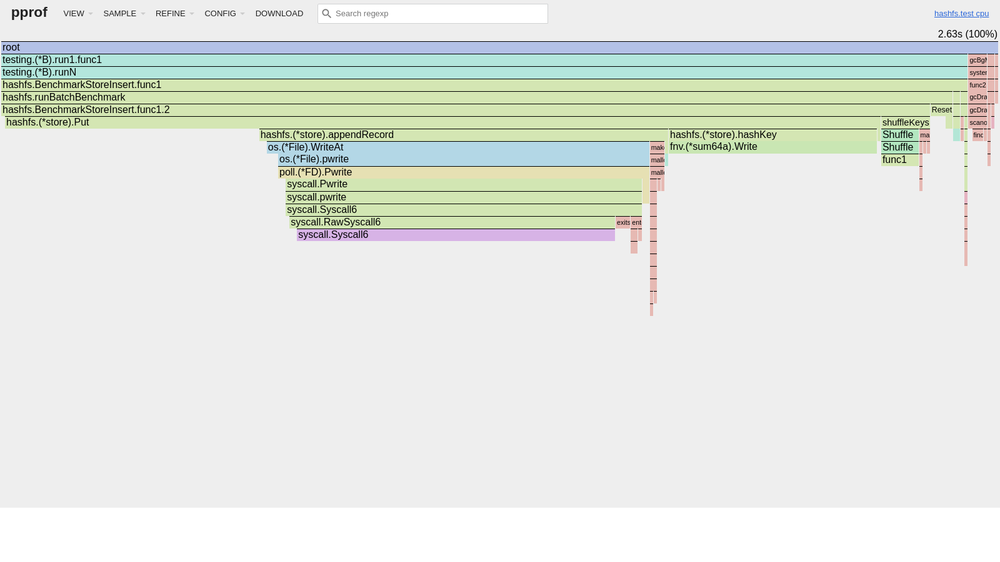

| Функция | flat | flat% | Вывод |
|:--------|-----:|------:|:------|
| `syscall.Syscall6` | 0.84s | 31.9% | `WriteAt`/`pwrite` syscall при append записи |
| `hashfs.Put` | 0.67s | 25.5% | Основная логика вставки |
| `fnv.Write` | 0.55s | 20.9% | FNV-1a хэширование ключа |

**Вывод:** профиль батчевой вставки остаётся syscall-heavy: около трети CPU уходит в `Syscall6` (`pwrite`), ещё четверть в `Put` и около 21% в хэширование. Узкие места не изменились, но распределение стало ровнее после фиксации `-benchtime=20x`.

#### CPU - Get

**Рисунок 4.2 - Flamegraph CPU (hashfs Get)**

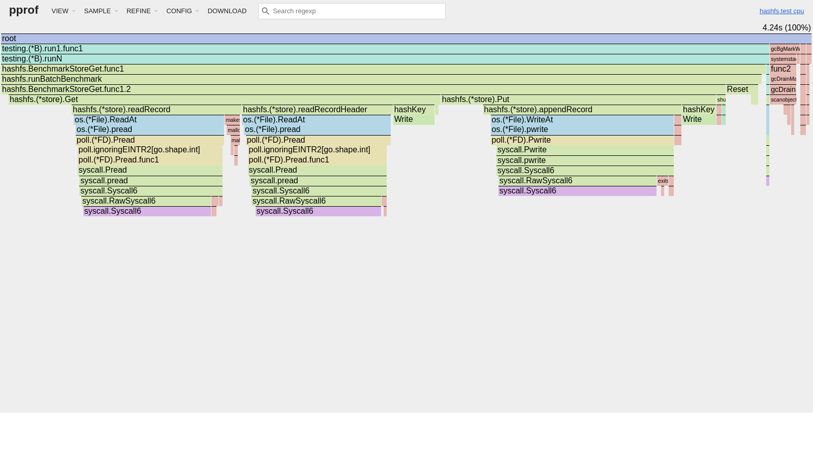

| Функция | flat | flat% | Вывод |
|:--------|-----:|------:|:------|
| `syscall.Syscall6` | 2.16s | 36.3% | `pread`/`pwrite` syscall в чтении/подготовке батча |
| `fnv.Write` | 1.09s | 18.3% | Хэширование ключей |
| `hashfs.Get` | 0.79s | 13.3% | Обход цепочки и проверка ключа |

**Вывод:** `Get` по-прежнему самый тяжёлый путь: ~36% CPU в syscall и ~13% в самой логике `Get`. В батчевом профиле дополнительно заметна стоимость подготовки данных (`Put`) перед измеряемой фазой чтения.

#### Память - Insert

**Рисунок 4.3 - Flamegraph памяти (hashfs Insert)**

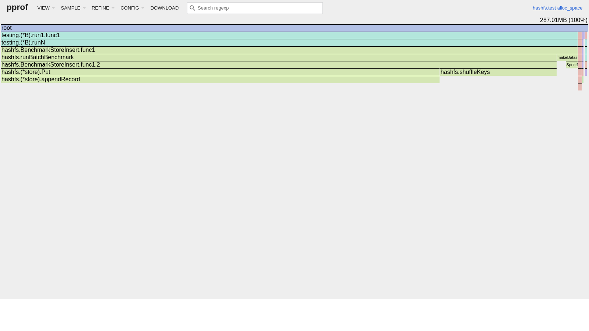

| Функция | alloc | alloc% | Вывод |
|:--------|------:|-------:|:------|
| `appendRecord` | 162.51 MB | 70.78% | Буфер записи на каждую вставку |
| `shuffleKeys` | 49.39 MB | 21.51% | Перемешивание ключей перед батчем |

**Вывод:** структура памяти не изменилась: главная аллокация - временный буфер в `appendRecord` (~71%). Переиспользование буферов (`sync.Pool`) остаётся основной гипотезой оптимизации.

---

### 4.2 Perfect Hash

#### CPU - Build

**Рисунок 4.4 - Flamegraph CPU (perfecthash Build)**

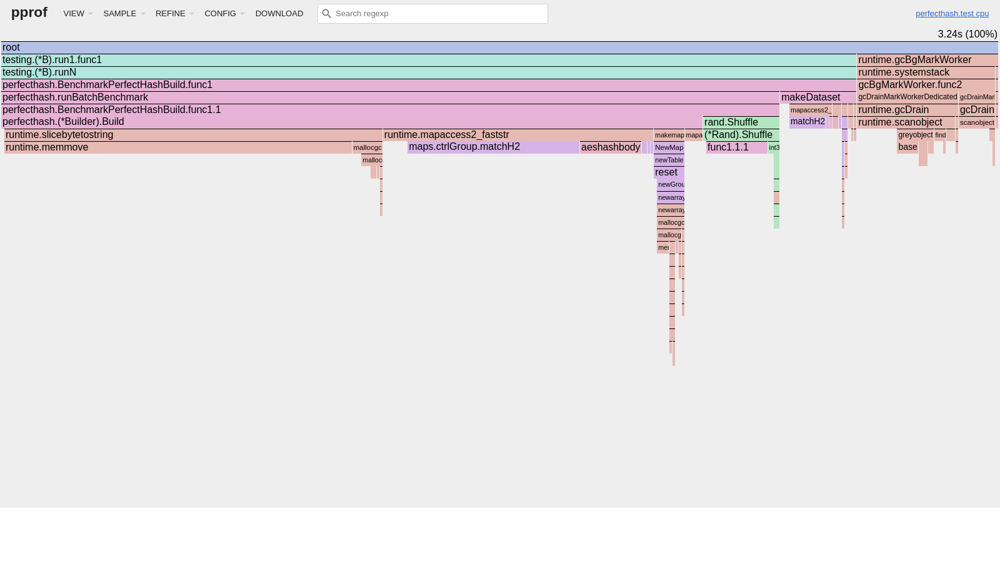

| Функция | flat | flat% | Вывод |
|:--------|-----:|------:|:------|
| `runtime.memmove` | 3.13s | 35.37% | Копирование строк/данных при росте map |
| `maps.ctrlGroup.matchH2` | 2.99s | 33.79% | Внутреннее сопоставление control bytes в Go map |
| `runtime.scanobject` | 0.85s | 9.60% | Работа GC на больших батчах Build |

**Вывод:** в батчевом Build доминирует именно внутренняя механика Go map: `memmove` + `matchH2` суммарно ~69%. Это подтверждает, что цена Build определяется реаллокациями/реорганизацией map при больших объёмах.

#### CPU - Lookup

**Рисунок 4.5 - Flamegraph CPU (perfecthash Lookup)**

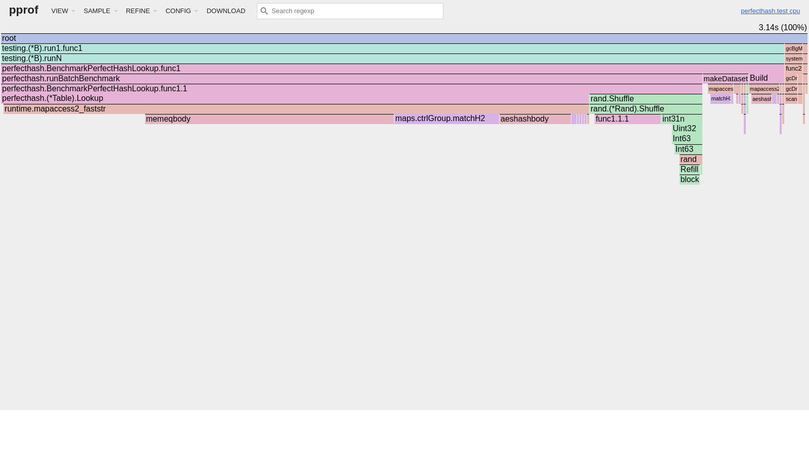

| Функция | flat | flat% | Вывод |
|:--------|-----:|------:|:------|
| `memeqbody` | 1.77s | 37.58% | Сравнение ключей при lookup |
| `maps.ctrlGroup.matchH2` | 1.04s | 22.08% | Проверка control bytes в map |
| `mapaccess2_faststr` | 0.70s | 14.86% | Доступ к Go map по строковому ключу |

**Вывод:** Lookup целиком runtime-bound: сравнение строк + `mapaccess`. 0 аллокаций на операцию сохраняются; после батчевого профилирования это подтверждается ещё стабильнее.

---

### 4.3 LSH 3D-индекс

#### CPU - Build

**Рисунок 4.6 - Flamegraph CPU (lsh3d Build)**

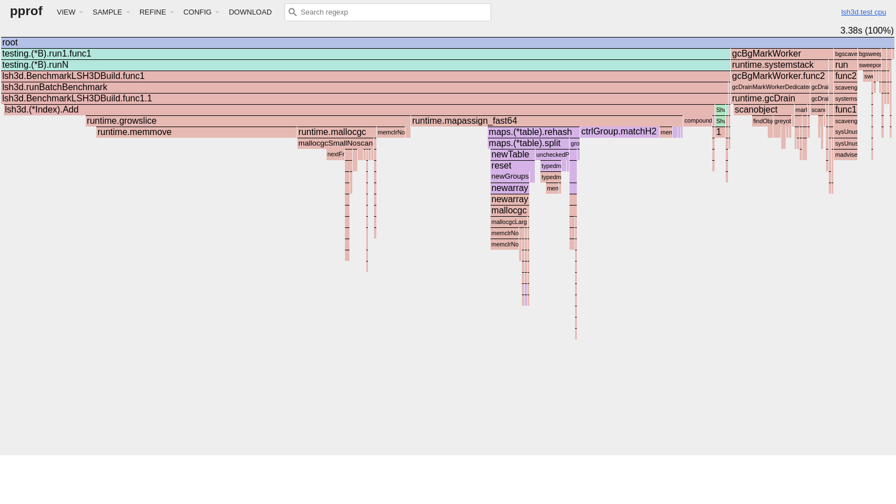

| Функция | flat | flat% | Вывод |
|:--------|-----:|------:|:------|
| `runtime.memmove` | 1.78s | 27.73% | Копирование элементов при росте bucket-слайсов |
| `runtime.mapassign_fast64` | 0.74s | 11.53% | Вставка в hash map таблиц |
| `maps.ctrlGroup.matchH2` | 0.64s | 9.97% | Поиск позиции в bucket group |
| `lsh3d.Add` | 0.57s | 8.88% | Логика Add в индекс |

**Вывод:** узкое место Build то же: `memmove` + `mapassign` + `matchH2` (суммарно ~49%). Это прямое следствие роста слайсов и map при вставке батчей.

#### CPU - Query

**Рисунок 4.7 - Flamegraph CPU (lsh3d Query)**

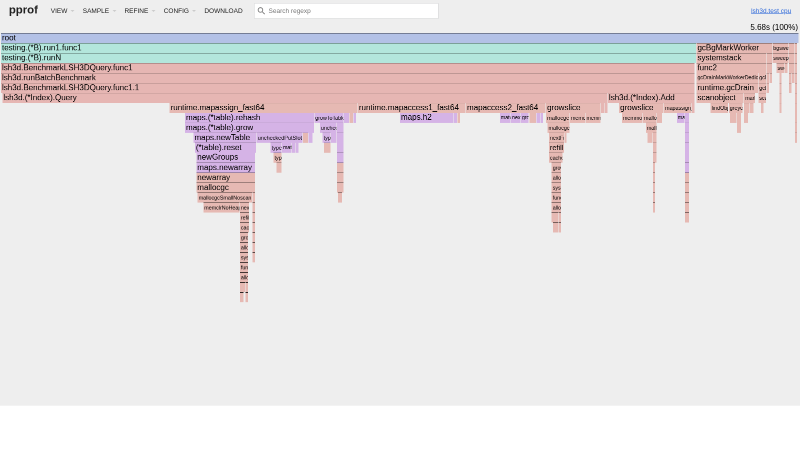

| Функция | flat | flat% | Вывод |
|:--------|-----:|------:|:------|
| `lsh3d.Query` | 18.98s | 23.99% | Основной обход L таблиц и сбор кандидатов |
| `runtime.memclrNoHeapPointers` | 7.77s | 9.82% | Очистка памяти при создании `seen`-map |
| `maps.h2` | 5.20s | 6.57% | Хэширование ключей в map |
| `runtime.memmove` | 4.57s | 5.78% | Рост внутренних структур кандидатов |

**Вывод:** в батчевом Query подтверждается давление на память и map: почти 10% CPU уходит только на `memclr` для `seen`-структур, а сама функция `Query` забирает ~24% flat CPU.

#### Память - Build / Query

**Рисунок 4.8 - Flamegraph памяти (lsh3d Build)**

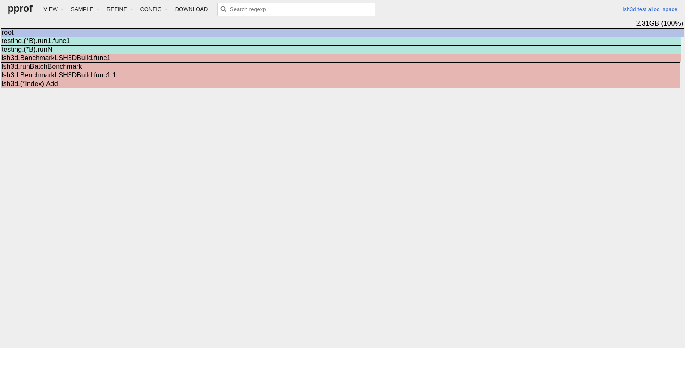

| Функция | alloc | alloc% | Вывод |
|:--------|------:|-------:|:------|
| `lsh3d.Add` | 2.30 GB | 99.49% | Основные аллокации при Build: вставка в L таблиц |
| `lsh3d.Query` | 38.12 GB | 93.90% | Основные аллокации в query-профиле: кандидаты и seen-структуры |

**Вывод:** профиль памяти после батчевого режима показывает два доминантных источника: `Add` (рост bucket-слайсов) и `Query` (временные структуры кандидатов/дедупликации). Для снижения пика памяти нужны предаллокация бакетов и переиспользование `seen`-контейнеров.

---

## 5. Вывод

Реализованы три алгоритма:

1. **File-backed hash table** с разрешением коллизий цепочками и файловым хранением через `mmap`. При фиксированных 20 итерациях `insert/update/delete` держатся в диапазоне ~0.66–1.42 мкс/оп, `get` возрастает до ~2.06 мкс/оп на больших N; это согласуется с профилем (syscall + обход цепочек).

2. **Perfect hash** - статический индекс `map[string]int` с поиском за ~20–179 нс (20x fixed iterations). Lookup остаётся без аллокаций; Build ограничен стоимостью внутренних операций Go map (`memmove`, `matchH2`).

3. **LSH 3D-индекс** на основе p-stable проекций. `Build`/`add` находятся около ~1.1–1.8 мкс/точку до N=100k, а `query` и `fullscan` растут быстрее из-за числа кандидатов и временных структур; это подтверждается CPU/Memory профилями (`Query` и map-операции доминируют на больших N).

Для всех замеров вычислены 95% доверительные интервалы; ключи/документы перемешиваются перед каждым батчем для получения реалистичных оценок.

Для LSH 3D-индекса тест-генератор создаёт точки равномерно в $[0, 100)^3$ с фиксированным seed - никакого внешнего датасета не требуется; ближайшие дубли для тестов генерируются добавлением гауссова шума $\sigma = 0.5$ к уже проиндексированным точкам.
