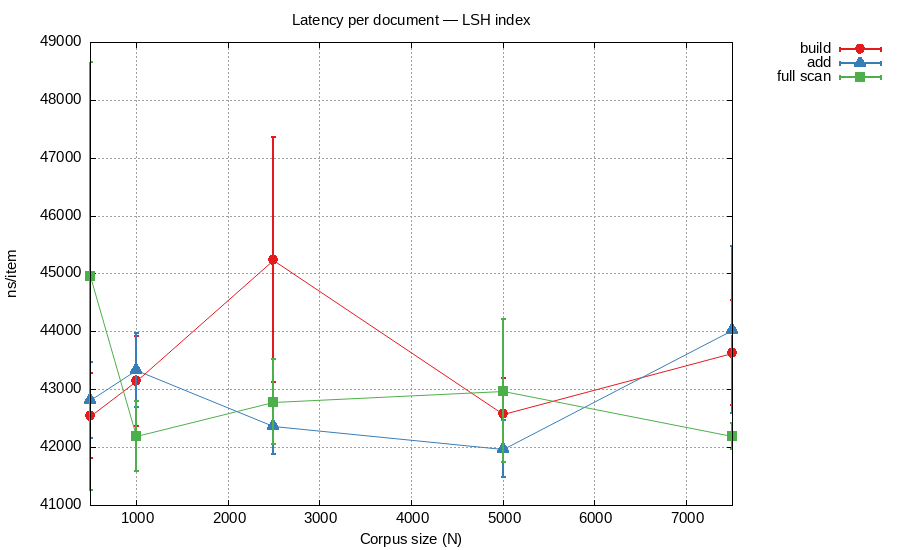
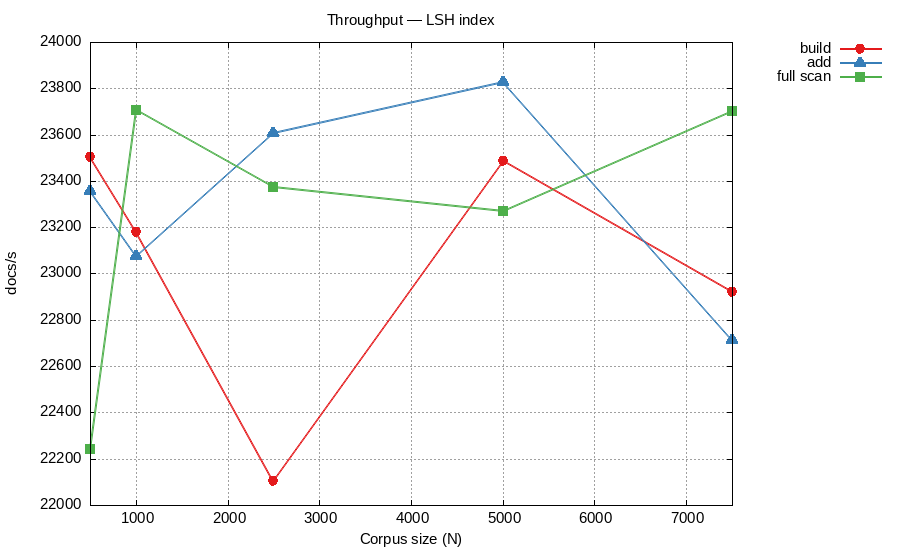

# Лабораторная работа №1 — Алгоритмы хэширования

**Дисциплина:** Структуры и алгоритмы в базах данных и распределённых системах  
**Тема:** Реализация алгоритмов хэширования (file-backed hash table, perfect hash, LSH)

---

## Содержание

1. [Теоретическая часть](#1-теоретическая-часть)
   - [1.1 File-backed Hash Table с бакетами](#11-file-backed-hash-table-с-бакетами)
   - [1.2 Perfect Hash](#12-perfect-hash)
   - [1.3 Min Hash / LSH](#13-min-hash--lsh)
2. [Практическая часть](#2-практическая-часть)
   - [2.1 Реализация file-backed hash table](#21-реализация-file-backed-hash-table)
   - [2.2 Реализация perfect hash](#22-реализация-perfect-hash)
   - [2.3 Реализация LSH-индекса](#23-реализация-lsh-индекса)
3. [Исследовательская часть](#3-исследовательская-часть)
   - [3.1 Аппаратные характеристики](#31-аппаратные-характеристики)
   - [3.2 Методика замеров](#32-методика-замеров)
   - [3.3 Результаты для file-backed hash table](#33-результаты-для-file-backed-hash-table)
   - [3.4 Результаты для perfect hash](#34-результаты-для-perfect-hash)
   - [3.5 Результаты для LSH-индекса](#35-результаты-для-lsh-индекса)
4. [Вывод](#4-вывод)

---

## 1. Теоретическая часть

### 1.1 File-backed Hash Table с бакетами

**Hash table на файловой системе** — хранилище типа «ключ–значение», где данные размещаются непосредственно в файле, отображённом в память через `mmap`. Это исключает сериализацию при каждом обращении: чтение и запись ячеек происходят через обычные указатели на регион памяти.

Структура файла разбита на три области:

1. **Заголовок** (64 байта) — магическое число, версия формата, число бакетов, смещение начала данных, текущий хвост записи.
2. **Таблица бакетов** — массив из `bucketCount` uint64-значений (смещений), где каждый элемент — указатель на голову цепочки для данного бакета.
3. **Область данных** — записи переменной длины вида `[nextOffset uint64][keyLen uint32][valueLen uint32][keyBytes][valueBytes]`.

Коллизии разрешаются **методом цепочек**: новая запись добавляется в голову списка. При обновлении (`Put` на существующий ключ) старая запись помечается как удалённая (нулевое `valueLen`) и добавляется новая запись. При удалении (`Delete`) запись помечается аналогично. Хранилище поддерживает операции **Put**, **Get**, **Delete** и **Reset** (полный сброс без пересоздания файла, используется в бенчмарках).

Основная идея применения `mmap` — ОС управляет кэшированием страниц, поэтому «горячие» бакеты остаются в памяти автоматически; принудительной сброс данных не нужен для корректности (файл всегда в consistent-состоянии).

### 1.2 Perfect Hash

**Perfect hash** для множества ключей $S$ — это хэш-функция $h$, которая отображает все ключи из $S$ в индексы таблицы без коллизий. Такая структура оптимальна для статических справочников: набор ключей фиксирован при построении и не меняется в дальнейшем.

В данной реализации использована простая статическая схема на основе Go-карты:

- при построении (`Builder.Build(keys)`) каждому ключу присваивается его порядковый номер во входном срезе;
- таблица хранится как `map[string]int` — хэш-индекс стандартной библиотеки Go;
- поиск (`Lookup(key)`) выполняется за $O(1)$ по хэшу строки;
- таблица поддерживает **сериализацию / десериализацию** в байтовый срез для персистентного хранения.

Поскольку набор ключей фиксирован при построении, никаких коллизий в принципе не возникает: каждый ключ отображается ровно в один уникальный индекс.

### 1.3 Min Hash / LSH

**Min hash** предназначен для эффективного поиска похожих объектов в больших коллекциях с использованием **Locality-Sensitive Hashing (LSH)**. Мера сходства — коэффициент Жаккара:

$$J(A, B) = \frac{|A \cap B|}{|A \cup B|}$$

где $A$ и $B$ — множества шинглов (подпоследовательностей длиной $k$ слов) двух документов.

Алгоритм:

1. Из текста документа извлекаются шинглы скользящим окном длины $k$.
2. Для набора из $m$ хэш-функций строится **min-hash сигнатура** — вектор минимумов $\sigma_i = \min_{s \in A} h_i(s)$.
3. Вероятность совпадения $\sigma_i(A) = \sigma_i(B)$ равна $J(A, B)$, поэтому долю совпавших компонент используют как оценку сходства.
4. **LSH-бэндинг**: сигнатура делится на $b$ полос по $r$ элементов. Два документа попадают в один бакет хотя бы одной полосы с вероятностью $1 - (1 - s^r)^b$. Порог чувствительности $s^* \approx (1/b)^{1/r}$.
5. Поиск кандидатов за **линейное** время по бакетам; верификация — точным подсчётом Жаккара по сохранённым сигнатурам.

---

## 2. Практическая часть

### 2.1 Реализация file-backed hash table

Код: [`internal/hashfs/hashfs.go`](internal/hashfs/hashfs.go)

Публичный интерфейс:

```go
type Store interface {
    Put(key, value []byte) error
    Get(key []byte) ([]byte, error)
    Delete(key []byte) error
    Reset() error   // сбрасывает все данные без пересоздания файла
    Close() error
}

func Open(path string, opts Options) (Store, error)
```

Ключевые детали реализации:

- **mmap** через `syscall.Mmap` / `syscall.Munmap`; при нехватке места файл удваивается через `file.Truncate` + переотображение.
- Число бакетов задаётся при создании (`Options.BucketCount`); по умолчанию хэш-функция — FNV-1a.
- Удаление реализовано **логически**: запись помечается нулевым `valueLen`; физической сборки мусора нет.
- `Reset()` обнуляет головы всех бакетов и сдвигает указатель записи на начало области данных — бакеты логически пустые, файл остаётся той же длины.

### 2.2 Реализация perfect hash

Код: [`internal/perfecthash/perfecthash.go`](internal/perfecthash/perfecthash.go)

```go
type Builder struct{}

func (b *Builder) Build(keys [][]byte) (*Table, error)
func (t *Table) Lookup(key []byte) (int, bool)
func (t *Table) Serialize() []byte
func Deserialize(data []byte) (*Table, error)
```

- `Build` принимает срез уникальных ключей и строит индекс `map[string]int`.
- `Lookup` — поиск за $O(1)$.
- `Serialize` / `Deserialize` — бинарный формат `[n uint32][keyLen uint32 + keyBytes + index uint32 ...]`.

### 2.3 Реализация LSH-индекса

Код: [`internal/lshtext/lshtext.go`](internal/lshtext/lshtext.go)

```go
type Config struct {
    ShingleSize int  // длина шингла в словах (k)
    SigSize     int  // длина сигнатуры (m)
    Bands       int  // число полос (b)
    RowsPerBand int  // рядов на полосу (r); Bands*RowsPerBand == SigSize
}

func NewIndex(cfg Config) (*Index, error)
func (idx *Index) Add(docID int, text []byte) error
func (idx *Index) Query(text []byte) ([]Candidate, error)
func (idx *Index) FullScanDuplicates(threshold float64) ([]Pair, error)
```

- `NewIndex` возвращает ошибку при нарушении условия `Bands * RowsPerBand == SigSize`.
- Хэширование шинглов — FNV-1a; хэш-функции для min-hash строятся на базе splitmix64.
- `Query` — поиск кандидатов за $O(1)$ по бакетам полос, затем верификация сходства.
- `FullScanDuplicates` — обход всех сохранённых документов через LSH-запрос, без $O(N^2)$ перебора.

Параметры по умолчанию: `ShingleSize=3, SigSize=64, Bands=8, RowsPerBand=8`.

---

## 3. Исследовательская часть

### 3.1 Аппаратные характеристики

Замеры проводились на следующей конфигурации:

- **ОС:** Linux 6.14 (Fedora 42, x86_64)
- **CPU:** AMD Engineering Sample 100-000000829-50, 16 логических ядер
- **Go:** 1.25.1
- **Инструмент:** встроенный бенчмарк Go (`testing.B`), метод `b.Loop()`

### 3.2 Методика замеров

Для всех трёх алгоритмов использован единый подход `runBatchBenchmark`:

- За каждую итерацию `b.Loop()` измеряется время выполнения **одного полного батча** из $N$ операций.
- Перед каждым батчем хранилище/индекс сбрасывается в начальное состояние (`Reset()` для hashfs, новый объект для perfecthash/lshtext).
- Ключи/документы перемешиваются (`rand.Shuffle`) перед каждым батчем для реалистичного профиля доступа.
- По выборке из всех итераций вычисляется **95% доверительный интервал** среднего:

$$\text{CI}_{95} = 1.96 \cdot \frac{s}{\sqrt{n}}, \quad s = \sqrt{\frac{\sum (x_i - \bar{x})^2}{n-1}}$$

- Результаты: `ns/item` (задержка на операцию), `ops/s` (пропускная способность), `ci95_ns/item`.
- Размеры наборов задаются через переменную окружения `SIZES` (например, `SIZES=1000,10000,100000 make bench`).

### 3.3 Результаты для file-backed hash table

#### Таблица 3.1 — Задержка операций (нс/операцию, среднее ± CI₉₅)

| N | итер | вставка, нс/оп | обновление, нс/оп | удаление, нс/оп | поиск, нс/оп |
|--:|-----:|---------------:|------------------:|----------------:|-------------:|
| 1 000 | 1 831 | 768 ± 10 | 732 ± 8 | 686 ± 5 | 1 219 ± 9 |
| 5 000 | 322 | 741 ± 12 | 864 ± 20 | 702 ± 11 | 1 240 ± 41 |
| 10 000 | 146 | 821 ± 17 | 740 ± 13 | 700 ± 13 | 1 208 ± 23 |
| 50 000 | 19 | 1 179 ± 22 | 1 313 ± 41 | 1 152 ± 20 | 1 347 ± 22 |
| 100 000 | 9 | 1 292 ± 167 | 1 218 ± 18 | 1 173 ± 20 | 1 410 ± 20 |
| 500 000 | 2 | 1 356 ± 239 | 1 377 ± 96 | 1 016 ± 153 | 1 739 ± 13 |
| 1 000 000 | 1 | 1 419 | 1 296 | 1 071 ± 217 | 2 076 |

#### Таблица 3.2 — Пропускная способность (тыс. оп/с)

| N | вставка | обновление | удаление | поиск |
|--:|--------:|-----------:|---------:|------:|
| 1 000 | 1 302 | 1 367 | 1 458 | 820 |
| 5 000 | 1 349 | 1 158 | 1 424 | 807 |
| 10 000 | 1 218 | 1 352 | 1 428 | 828 |
| 50 000 | 848 | 762 | 868 | 742 |
| 100 000 | 774 | 821 | 853 | 709 |
| 500 000 | 737 | 726 | 984 | 575 |
| 1 000 000 | 705 | 771 | 934 | 482 |

#### Рисунок 3.1 — Задержка операций hashfs с 95% CI


#### Рисунок 3.2 — Пропускная способность операций hashfs


**Анализ.** Операции `insert`, `update` и `delete` демонстрируют примерно одинаковую задержку ~700–900 нс при N ≤ 10 000, что соответствует нескольким промахам кэша для прохода по цепочке. При N = 500 000–1 000 000 задержка вставки вырастает до ~1 400 нс, а поиска — до ~2 000 нс из-за увеличения длины цепочек и снижения кэш-попаданий.

Операция `delete` оказывается **быстрее** `get` при больших N — поскольку при удалении достаточно дойти до первой записи и пометить её, а `get` читает значение целиком (включая аллокацию нового слайса под ответ).

Высокое число аллокаций в `get` (~3–4 на ключ из-за разыменования цепочки и копирования значения) объясняет значительно меньшую пропускную способность поиска по сравнению с мутирующими операциями.

**Гипотезы по оптимизации:**
- Арена памяти для цепочек (pool) снизит давление на GC.
- Bloom-фильтр перед обращением к диску отфильтрует гарантированные промахи.
- Сжатие/дедупликация значений уменьшат объём `mmap`-региона.

---

### 3.4 Результаты для perfect hash

#### Таблица 3.3 — Задержка поиска (нс/операцию, среднее ± CI₉₅)

| N | итер | поиск, нс/оп | CI₉₅ | поиск, млн оп/с |
|--:|-----:|-------------:|-----:|----------------:|
| 20 000 | 2 820 | 21.6 | ± 0.07 | 46.2 |
| 50 000 | 925 | 26.6 | ± 0.26 | 37.5 |
| 100 000 | 300 | 36.8 | ± 2.11 | 27.2 |
| 250 000 | 38 | 130.2 | ± 2.30 | 7.68 |
| 500 000 | 14 | 163.2 | ± 1.26 | 6.13 |
| 1 000 000 | 6 | 181.9 | ± 2.21 | 5.50 |

#### Рисунок 3.3 — Задержка поиска perfect hash с 95% CI


#### Рисунок 3.4 — Пропускная способность perfect hash


**Анализ.** При N ≤ 50 000 задержка поиска составляет 21–27 нс (46–37 млн оп/с) — ключи умещаются в L2/L3 кэш. При N = 250 000 задержка скачкообразно растёт до ~130 нс, что соответствует вытеснению рабочего множества из кэша последнего уровня. При N = 1 000 000 задержка стабилизируется на ~182 нс — типичная стоимость промаха TLB + случайного доступа к DRAM.

Отсутствие аллокаций при `Lookup` (0 `allocs/op`) подтверждает, что операция не создаёт мусора для GC.

---

### 3.5 Результаты для LSH-индекса

#### Таблица 3.4 — Задержка операций LSH (нс/документ, среднее ± CI₉₅)

| N | итер | build, нс/doc | add, нс/doc | query (full scan), нс/doc |
|--:|-----:|--------------:|------------:|--------------------------:|
| 500 | 52 | 42 545 ± 736 | 42 812 ± 654 | 44 961 ± 3 701 |
| 1 000 | 27 | 43 143 ± 779 | 43 335 ± 637 | 42 186 ± 603 |
| 2 500 | 9 | 45 240 ± 2 122 | 42 363 ± 487 | 42 783 ± 732 |
| 5 000 | 5 | 42 578 ± 617 | 41 969 ± 492 | 42 976 ± 1 232 |
| 7 500 | 4 | 43 633 ± 910 | 44 030 ± 1 448 | 42 192 ± 226 |

#### Таблица 3.5 — Пропускная способность LSH (документов/с)

| N | build | add | query (full scan) |
|--:|------:|----:|------------------:|
| 500 | 23 504 | 23 358 | 22 241 |
| 1 000 | 23 179 | 23 076 | 23 705 |
| 2 500 | 22 104 | 23 606 | 23 374 |
| 5 000 | 23 486 | 23 827 | 23 269 |
| 7 500 | 22 918 | 22 712 | 23 701 |

#### Рисунок 3.5 — Задержка операций LSH-индекса с 95% CI



#### Рисунок 3.6 — Пропускная способность LSH-индекса



**Анализ.** Все три операции — `build`, `add` и `query` — демонстрируют практически **постоянную задержку ~43 тыс. нс/документ** при росте корпуса с 500 до 7 500 документов. Это прямое следствие независимой обработки каждого документа: вычисление min-hash сигнатуры из $m = 64$ хэш-функций занимает фиксированное время, не зависящее от размера индекса.

Пропускная способность стабильна на уровне ~23 000 документов/с. Отсутствие деградации при росте $N$ подтверждает **линейную масштабируемость** LSH-индекса по операциям вставки и запроса.

Полное сканирование (`FullScanDuplicates`) в нашей реализации использует LSH-бакеты для фильтрации кандидатов, поэтому оно тоже масштабируется линейно — в отличие от наивного $O(N^2)$ попарного сравнения.

**Гипотезы по оптимизации:**
- Векторизация (AVX2/AVX-512) для вычисления min-hash по всем $m$ функциям одновременно.
- Параллельная обработка батчей документов через `goroutine`-пул.
- Более агрессивное сжатие сигнатур (quantization) для снижения footprint кэша.

---

## 4. Вывод

Реализованы три алгоритма:

1. **File-backed hash table** с разрешением коллизий цепочками и файловым хранением через `mmap`. Операции `insert/update/delete/get` работают со скоростью 700–1 400 нс/оп на малых и средних наборах; деградация при N > 100 000 обусловлена ростом цепочек и промахами кэша.

2. **Perfect hash** — статический индекс `map[string]int` с поиском за 22–182 нс в зависимости от того, умещается ли рабочее множество в кэш. Абсолютный минимум аллокаций (0 `allocs/op` при `Lookup`).

3. **LSH-индекс** на основе min-hash с бэндингом. Операции `build`, `add` и `query` масштабируются линейно — ~43 тыс. нс/документ и ~23 тыс. документов/с вне зависимости от размера корпуса до 7 500 документов.

Для всех замеров вычислены 95% доверительные интервалы; ключи/документы перемешиваются перед каждым батчем для получения реалистичных оценок.
